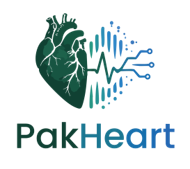

<p align="center">
  
</p>

<h1 align="center">
  PakHeart: NATIONAL AI-READY ECG DATASET
</h1>

<p align="center">
  <strong>
    Building standardized, traceable and clinically validated ECG research infrastructure
  </strong>
</p>

<p align="center">
  Supporting population-specific cardiovascular research and future AI development
</p>

<p align="center">
  
  
  
</p>

---

## 🔵 About PakHeart

**PakHeart** is a research initiative focused on developing a standardized, clinically validated and AI-ready ECG research resource.

The project is designed to establish the governance, clinical, technical and validation infrastructure required for reliable ECG data collection, standardization, validation and future AI research.

PakHeart is currently in:

### 🟢 Phase-0 — Foundation & Validation

Current priorities include:

- governance and ethics
- ECG source and device characterization
- metadata standardization
- secure infrastructure
- ECG ingestion
- data standardization
- signal quality control
- validation workflows
- clinical review
- research readiness

---

## 🟢 Project Workstreams

| Workstream | Current Focus |
|---|---|
| **Governance** | Governance, ethics, privacy and document control |
| **Clinical** | ECG workflows, device characterization and clinical validation |
| **Metadata** | Standardized ECG metadata and data dictionary |
| **Data Collection** | Controlled ECG collection and site coordination |
| **Ingestion** | ECG parsing, format conversion and standardization |
| **Validation** | File, signal and metadata quality verification |
| **Research** | ECG AI, benchmarking and lead-reduction research |
| **Knowledge** | Literature, public datasets, standards and references |

---

## 🔵 PakHeart Repository Ecosystem

The wider PakHeart project is organized into dedicated repositories:

| Repository | Purpose |
|---|---|
| **PakHeart-Overview** | Central project dashboard and navigation |
| **PakHeart-Governance** | Governance and document control |
| **PakHeart-Metadata-Schema** | Metadata schema and data dictionary |
| **PakHeart-Data-Collection** | ECG collection workflows |
| **PakHeart-Ingestion-Pipeline** | ECG ingestion and standardization |
| **PakHeart-Validation** | Validation and AI-readiness |
| **PakHeart-Lead-Reduction** | Lead-reduction and reconstruction research |
| **PakHeart-Knowledge-Library** | Literature, standards and technical references |
| **PakHeart-Marketing** | Publications and approved communications |

---

## 🟢 Current Technical Priorities

<table>
<tr>
<td width="50%" valign="top">

### Data & Infrastructure

- ECG machine characterization
- Source-format inventory
- Metadata standardization
- Secure data transfer
- Secure storage
- De-identification
- Audit logging

</td>

<td width="50%" valign="top">

### Pipeline & Validation

- Format detection
- ECG parsing
- Standardization
- Signal quality checks
- Metadata validation
- Benchmarking
- Provenance tracking

</td>
</tr>
</table>

---

## 🔵 Project Management Approach

PakHeart uses a structured GitHub workflow:

```text
Issue
   │
   ▼
Working Branch
   │
   ▼
Commits
   │
   ▼
Pull Request
   │
   ▼
Review
   │
   ▼
Approval where required
   │
   ▼
Merge to main
   │
   ▼
Release / Tag where applicable
